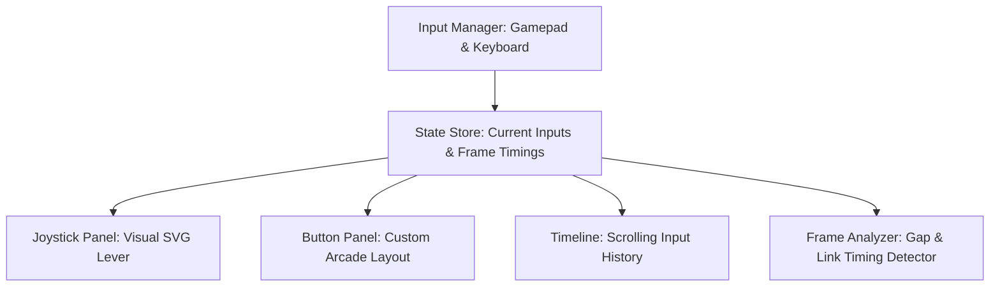

# Implementation Plan: Down-Back Training Tool

**Down-Back** is a professional-grade training and timing tool for fighting games. It helps players visualize inputs, debug combos, and perfect link/cancel timings with frame-perfect precision (60 FPS standard).

---

## 🎨 Visual Identity & UI Design System
We will create a premium, dark-mode arcade-inspired dashboard featuring:
- **Palette**: Dark carbon backgrounds (`#0a0a0a`), slate overlays, neon cyan/green highlights (representing active inputs), and vivid red accents (representing "down-back" and errors/gaps).
- **Glassmorphism**: Soft backdrop blurs and subtle borders to define individual panels (Joystick, Buttons, Timeline, Analyzer).
- **Smooth Micro-animations**: Joystick knob sliding smoothly between directions, action buttons pulsing under active presses, and timing lines gliding down the screen.

---

## 🏗️ Core Architecture & Components

### 1. `InputManager` (Gamepad & Keyboard Hook)
- Uses HTML5 Gamepad API inside a `requestAnimationFrame` loop (tick rate 60 FPS) to fetch precise button/stick values.
- Listens to global keyboard events with customizable bindings (WASD for movement, JKL / UIO for actions).
- Normalizes all inputs to standard fighting game notation:
  - **Directions (Num-Pad)**: `1` (Down-Back), `2` (Down), `3` (Down-Forward), `4` (Back), `5` (Neutral), `6` (Forward), `7` (Up-Back), `8` (Up), `9` (Up-Forward).
  - **Buttons**: `LP` (Light Punch), `MP` (Medium Punch), `HP` (Heavy Punch), `LK` (Light Kick), `MK` (Medium Kick), `HK` (Heavy Kick), and `Select` / `Start` for resets.

### 2. `JoystickPanel` & `ButtonPanel` (SVG Renderer)
- **Joystick**: Renders a dynamic joystick knob showing the path from center. Displays a numeric layout overlay that lights up indicating the current directional zone.
- **Button Panel**: An 8-button arcade layout. Keys light up when pressed, displaying pressure/analog curves if a gamepad is used.

### 3. `InputTimeline` (Scrolling History)
- Shows a list of sequential inputs, grouped by state and annotated with duration in frames:
  - e.g., 🡧 (Down-Back) for `18` frames, 🡢 + `HP` (Hadouken) for `3` frames.
- Allows hovering over an entry to inspect the exact timestamp.

### 4. `TimingTrainer` (Gap & Combo Analyzer)
- **Gap Detector**: Measures the exact frame gap between releasing button A and pressing button B. Displays green for tight links (e.g. 1-3 frames), yellow for normal links (4-6 frames), and red for slow execution.
- **Rhythm Metronome**: Generates high-frequency click sounds (using Web Audio API) at specified intervals or custom sequences to help players practice links.
- **Combo Recorder**: Records an input string and lists the precise frames elapsed between each action.

---

## 📅 Milestones

1. **Setup & Global Styling**: Implement layout shell, global CSS variables, and base Tailwind layout.
2. **Input Controller Hook**: Build a React hook `useInput` supporting keyboard + gamepad API with 60 FPS loop integration.
3. **Visual Controller Component**: Draw responsive Joystick and Button components.
4. **Scrolling Timeline**: Build the real-time history scroll bar with frame counting logic.
5. **Timing Analyzer**: Implement combo recording, link gap detection, and metronome helper.
6. **Refinement & Polishing**: Optimize for frame timing consistency, add premium sound effects, and verify build.
